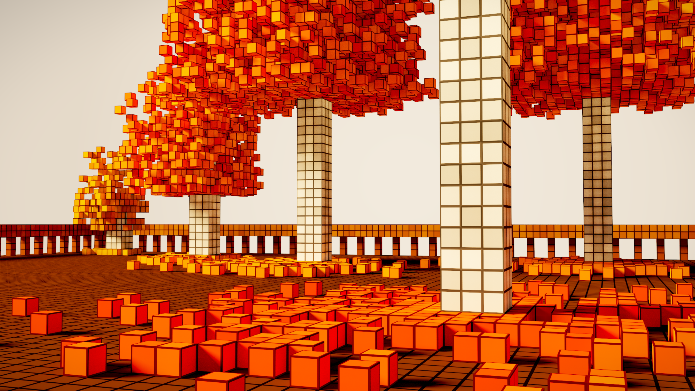
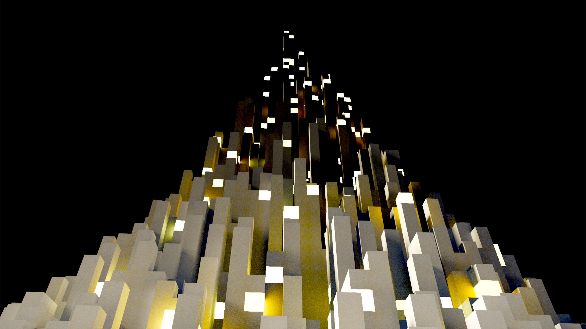
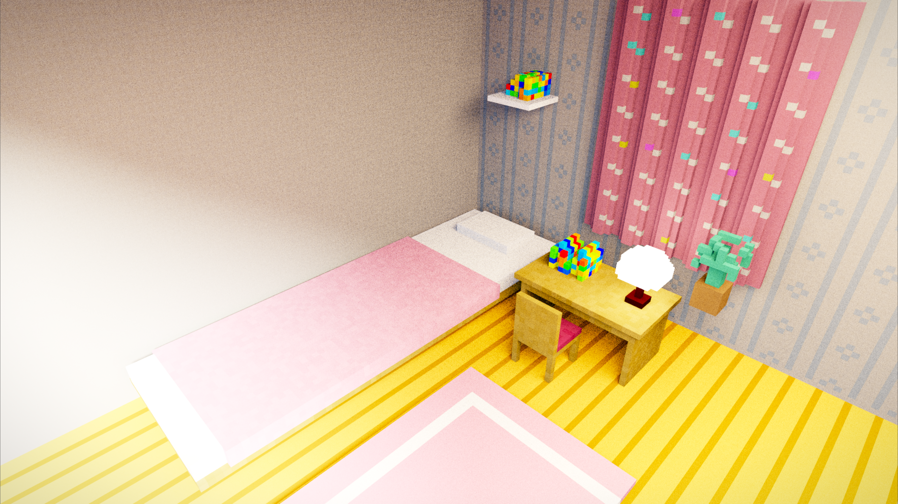

# Godot Compute Shader Voxel Path Tracer

GPU voxel rendering in Godot 4 using a Vulkan compute shader and `RenderingDevice`. The project includes nine procedural voxel scenes, four Minecraft NBT maps, progressive path tracing, soft shadows, one-bounce global illumination, ACES tone mapping, and an interactive camera/UI.

## Gallery







## Requirements

- Godot 4.7 or a compatible Godot 4 build with the Forward+ renderer.
- A Vulkan-capable GPU and up-to-date graphics drivers. This project uses a compute pipeline and will not run on Compatibility mode.

## Install and run

1. Install Godot 4.7 from [godotengine.org](https://godotengine.org/download/).
2. Clone this repository or download the source archive.
3. Import the repository root in Godot. `project.godot` is at the repository root.
4. Select **Project > Run Project** (or press **F6/F5**, depending on the editor state).

The first launch compiles the GLSL compute shaders. Choose a scene from the map selector and use the controls panel to change resolution, color grading, lighting, shadows, reflections, GI, and maximum samples per pixel.

## Controls

- Preset 1: automatic orbit; drag with the left mouse button to orbit and use the wheel to zoom.
- Flycam: hold the right mouse button and use `W/A/S/D`; `Space/E` moves up and `Ctrl/Q` moves down.
- `F`: capture/release the mouse in Flycam mode.
- `R`: reset the camera.
- `H` or `Tab`: toggle the controls panel.
- `F12`: save a screenshot into the project directory.

## Command-line examples

```text
godot --path . --scene=autumn_diorama
godot --path . --scene=city_grid --max-spp=256 --hide-ui
godot --path . --scene=cozy_bedroom --capture-spp=512 --output=render.png
```

## Technical notes

`voxel_viewer.gd` owns the GPU buffers, camera UBO, progressive accumulation, and UI. `voxel_raytracer.glsl` performs DDA voxel traversal, direct/indirect lighting, soft-shadow sampling, reflections, and tone mapping. `procedural_generator.gd` creates the procedural scenes, while `nbt_reader.gd` loads the included Minecraft structure files and palette data.

The shader and GDScript sources are intentionally kept readable so the rendering pipeline can be studied directly in the repository.

## License

Released under the MIT License. See [`LICENSE`](LICENSE).
